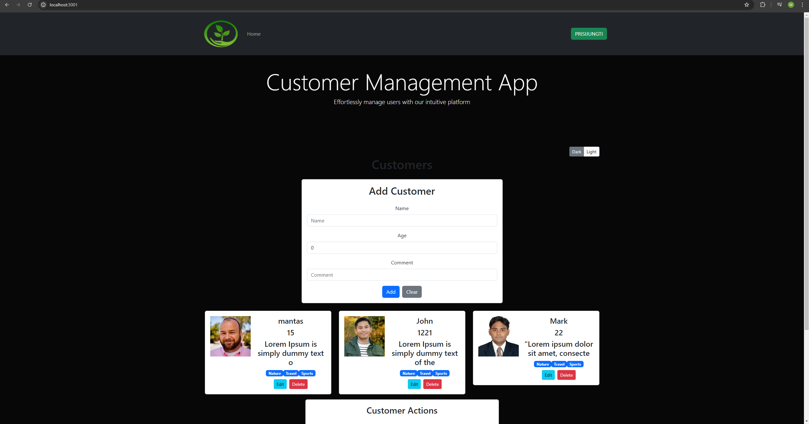

# UserManagement Website

Bootstrap mini website 


### `npm run dev`

Runs the app in the development mode.\
Open [http://localhost:3000](http://localhost:3000) to view it in the browser.

## Features

- Modern layout with custom colors/styles/backgrounds
- Responsive design
- Sticky navbar with style changes on scroll
- Bootstrap modals
- Form & input styles
- Web Api
- User Management

### Project Access
Project URL: http://localhost:3000/api/customers
Access Credentials: [Provide any necessary credentials or access details]

Thunder Client is a Visual Studio Code extension used for sending HTTP requests to test and debug APIs
Endpoint: POST http://localhost:3000/api/customers

## Usage 
This website is built with [Bootstrap](https://getbootstrap.com/) and [Sass](https://sass-lang.com/). It uses [Font Awesome](https://fontawesome.com/) for icons.

In order to customize this website, you need to install [Node.js](https://nodejs.org/en/). Then, clone this repository and run:

```bash
npm install
```

This will install Bootstrap, Sass and Font Awesome. To build your CSS files from Sass, run:

```bash
npm run sass:build
```

To watch your Sass files for changes, run:

```bash
npm run sass:watch
```

You can add Bootstrap variables to the `bootstrap.scss` file. You can look at the file `node_modules/bootstrap/dist/scss/_variables.scss` for a list of all the variables. Do NOT edit the `variables.scss` file directly, as it will be overwritten when you update Bootstrap.

To add your own custom styles, use the `styles.scss` file.
